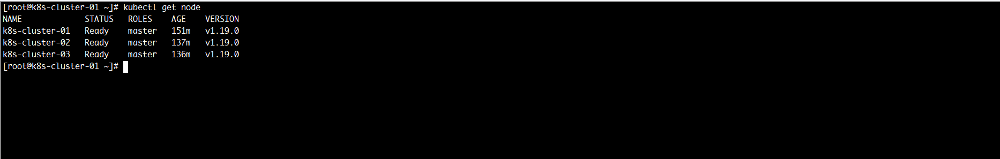
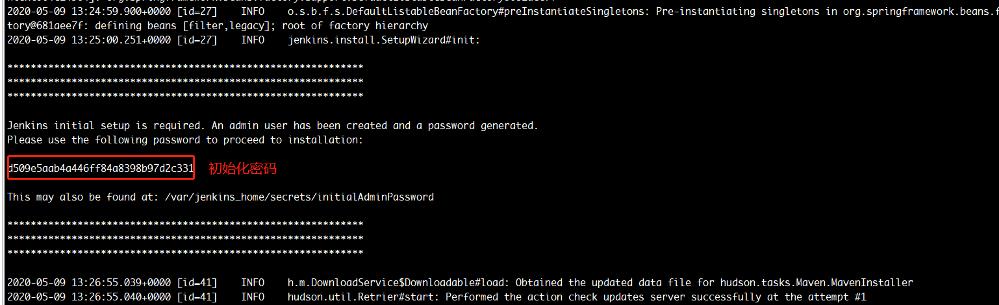

## k8s平台搭建

### 1. 安装docker
``` shell
#!/bin/bash

yum remove docker \
                  docker-client \
                  docker-client-latest \
                  docker-common \
                  docker-latest \
                  docker-latest-logrotate \
                  docker-logrotate \
                  docker-engine -y

yum install -y yum-utils vim  net-tools gcc 
yum-config-manager --add-repo http://mirrors.aliyun.com/docker-ce/linux/centos/docker-ce.repo
yum makecache fast
yum install  -y docker-ce docker-ce-cli containerd.io
yum -y install device-mapper-persistent-data lvm2
mkdir -p /etc/docker
cat > /etc/docker/daemon.json <<EOF
{
        "registry-mirrors": [
                "http://registry.cnegroup.com",
                "https://1nj0zren.mirror.aliyuncs.com",
                "https://docker.mirrors.ustc.edu.cn",
                "http://f1361db2.m.daocloud.io",
                "https://registry.docker-cn.com"
        ],
        "insecure-registries": [
                "registry.cnegroup.com"
	    ],
        "exec-opts": ["native.cgroupdriver=systemd"],
        "log-driver": "json-file",
        "log-opts": {
                "max-size": "100m"
        },
        "storage-driver": "overlay2"
}
EOF
# 设置开机启动
systemctl enable docker
# 开启远程tcp端口
sed -i 's/-H fd:\/\//-H fd:\/\/ -H tcp:\/\/0.0.0.0:2375/g' /usr/lib/systemd/system/docker.service

systemctl daemon-reload && systemctl start docker

# 最新版访问 https://get.daocloud.io/#install-compose
curl -L https://get.daocloud.io/docker/compose/releases/download/1.25.5/docker-compose-`uname -s`-`uname -m` > /usr/local/bin/docker-compose
chmod +x /usr/local/bin/docker-compose
systemctl disable firewalld && systemctl stop firewalld
```

### 2. 安装nfs server

nfs-server和nfs-client都执行的脚本
```shell
#!/bin/bash
yum -y install nfs-utils rpcbind
systemctl enable rpcbind
systemctl enable nfs-server
systemctl start rpcbind
systemctl start nfs-server
```
nfs-server设置共享目录
```shell
# 此处创建/data/nfs目录作为共享目录
mkdir -p /data/nfs
# 为共享目录设置权限，否则数据写入会出问题
chmod -R 777 /data/nfs
# nfs配置文件为/etx/exports,可自定义导出目录及读写权限
echo '/data/nfs 192.168.2.*(rw,sync,no_root_squash)' >> /etc/exports
```
nfs-client 挂载共享目录
```shell
# 查看nfs-server共享目录
showmount -e ${nfs-server-ip}
# 自定义配置local_dir位置,若出现不能正常挂载需重启服务器
mount -t nfs ${nfs-server-ip}:/data/nfs  ${local_dir}
# 使用如下命令可实现开机自动挂载
# echo '$NFS_SERVER_HOST:$NFS_SERVER_DIR $LOCAL_DIR nfs rw' >> /etc/fstab
```
**注 ：** nfs-server最好部署在单独的服务器上，若nfs-server与k8s部署在同一台服务器会出现挂载失败

### 3. 安装k8s-master高可用
使用nginx做load balance, 安装3台k8s-master
#### 3.1 部署nginx
使用docker部署nginx, 镜像版本选择1.19.2, 也可以选择其它版本，**但需要安装支持–with-stream支持的nginx**可使用nginx -V查看
```shell
# 此处暴露两个端口，80端口下面会代理kuboard的服务, 6443端口代理apiserver端口
docker run -d --name nginxd -p 80:80 -p 6443:6443 nginx:1.19.2
```
nginx.conf配置文件如下
```conf
user  nginx;
worker_processes  1;

error_log  /var/log/nginx/error.log warn;
pid        /var/run/nginx.pid;

events {
    worker_connections  1024;
}

http {
    include       /etc/nginx/mime.types;
    default_type  application/octet-stream;

    log_format  main  '$remote_addr - $remote_user [$time_local] "$request" '
                      '$status $body_bytes_sent "$http_referer" '
                      '"$http_user_agent" "$http_x_forwarded_for"';

    access_log  /var/log/nginx/access.log  main;

    sendfile        on;
    #tcp_nopush     on;
    keepalive_timeout  65;
    #gzip  on;
    include /etc/nginx/conf.d/*.conf;
}

stream {
    upstream apiserver {
        server 192.168.2.61:6443 weight=5 max_fails=3 fail_timeout=30s;
        server 192.168.2.62:6443 weight=5 max_fails=3 fail_timeout=30s;
        server 192.168.2.63:6443 weight=5 max_fails=3 fail_timeout=30s;
    }

    server {
        listen 6443;
        listen  [::]:6443;
        proxy_connect_timeout 1s;
        proxy_timeout 3s;
        proxy_pass apiserver;
    }
}

upstream kuboard {
    server 192.168.2.61:32567;
    server 192.168.2.62:32567;
    server 192.168.2.63:32567;
}

server {
    listen       80;
    listen  [::]:80;
    server_name  localhost;

    location / {
        proxy_pass   http://kuboard;
    }
}
```

**非常重要：** nginx的代理服务器必需配置k8s-master的域名映射，否则在初始化控制平面时找不到 hostname错误

```shell
cat >> /etc/hosts << EOF
# 此处设置nginx服务器域名映射为cne-k8s.com
192.168.2.60 cne-k8s.com
192.168.2.61 k8s-cluster-01
192.168.2.62 k8s-cluster-02  
192.168.2.63 k8s-cluster-03
EOF
```
#### 3.2 安装k8s组件

三台master服务器上均执行如下脚本，安装k8s组件

```shell
cat >> /etc/hosts << EOF
192.168.2.60 cne-k8s.com
192.168.2.61 k8s-cluster-01
192.168.2.62 k8s-cluster-02  
192.168.2.63 k8s-cluster-03
EOF

# 关闭交换分区
swapoff -a
sed -i '/ swap /s/.*/#&/g' /etc/fstab

# 关闭SELINUX
setenforce 0
sed -i 's/SELINUX=.*/SELINUX=disabled/g'  /etc/selinux/config

cat > /etc/sysctl.d/k8s.conf <<EOF
net.ipv4.ip_forward = 1
net.bridge.bridge-nf-call-ip6tables = 1
net.bridge.bridge-nf-call-iptables = 1
EOF
sysctl --system

yum-config-manager --add-repo https://mirrors.aliyun.com/docker-ce/linux/centos/docker-ce.repo

cat <<EOF > /etc/yum.repos.d/kubernetes.repo
[kubernetes]
name=Kubernetes
baseurl=https://mirrors.aliyun.com/kubernetes/yum/repos/kubernetes-el7-x86_64/
enabled=1
gpgcheck=1
repo_gpgcheck=1
gpgkey=https://mirrors.aliyun.com/kubernetes/yum/doc/yum-key.gpg https://mirrors.aliyun.com/kubernetes/yum/doc/rpm-package-key.gpg
EOF

yum install -y --nogpgcheck kubectl kubelet kubeadm wget
systemctl enable kubelet && systemctl start kubelet
```
#### 3.3 初始化k8s

在第一台master上执行如下命令

```shell
kubeadm init --kubernetes-version=1.19.0  \
--apiserver-advertise-address=0.0.0.0   \
--control-plane-endpoint=cne-k8s.com   \
--image-repository registry.aliyuncs.com/google_containers  \
--upload-certs \
--service-cidr=10.10.0.0/16 --pod-network-cidr=10.122.0.0/16 | tee kubeadm-init.log

mkdir -p $HOME/.kube
sudo cp -i /etc/kubernetes/admin.conf $HOME/.kube/config
sudo chown $(id -u):$(id -g) $HOME/.kube/config

# 安装网络组件
rm -f calico.yaml
wget https://docs.projectcalico.org/manifests/calico.yaml
kubectl apply -f calico.yaml

# 安装kuboard
rm -f kuboard.yaml
wget https://kuboard.cn/install-script/kuboard.yaml
kubectl apply -f  kuboard.yaml

rm -f metrics-server.yaml
wget https://addons.kuboard.cn/metrics-server/0.3.7/metrics-server.yaml
kubectl apply -f  metrics-server.yaml
```
**注：**
```text
--kubernetes-version: k8s版本，可根据配置更换
--control-plane-endpoint: 控制平面端点，此处配置nginx代理服务器域名，k8s会自动访问6443端口
--image-repository：k8s镜像地址，默认访问google, 国内使用aliyun k8s镜像仓库
--upload-certs：将控制平面证书上传到 kubeadm-certs Secret
--service-cidr：servic服务网段
--pod-network-cidr：pod网段，此处需要与calico组件配置一样
```
也可以使用如下命令查看默认初始化配置
```shell
kubeadm config print init-defaults > init-configuration.yaml
# 修改配置文件init-configuration.yaml中对应参数，使用如下命令初始化集群，与命令行效果一样
kubeadm --config init-configuration.yaml --upload-certs
```


下面的脚本需从上图所示获取执行命令后在其它两台master上执行

```shell
  kubeadm join cne-k8s.com:6443 --token squpn1.8a4ulg3wxlxqmn7z \
    --discovery-token-ca-cert-hash sha256:43d27fe37c9f0f086c5c406d5215e0136f92956b813b01d43c3f2a84b0d0cecd \
    --control-plane --certificate-key 8fc078f59a05a9bb07d63cfba3d8e9d572310d2fe155c6951d5110e849881fea
```
安装成功后效果如下


#### 3.4 初始化work-node
work-node在安装完k8s组件 且成功部署master集群后执行图中节点加入命令即可组成k8s高可用集群

```shell
kubeadm join cne-k8s.com:6443 --token squpn1.8a4ulg3wxlxqmn7z \
    --discovery-token-ca-cert-hash sha256:43d27fe37c9f0f086c5c406d5215e0136f92956b813b01d43c3f2a84b0d0cecd
```
### 4. 部署nfs
使用nfs可实现基于 storageClass的动态存储，若不在默认命名空间下需要修改namespace, 资源清单如下：

```yaml
# serviceaccount.yaml 
apiVersion: v1
kind: ServiceAccount
metadata:
  name: nfs-provisioner
  namespace: dev
```

```yaml
# rbac.yaml
apiVersion: v1
kind: ServiceAccount
metadata:
  name: nfs-provisioner
  namespace: dev

---
kind: ClusterRole
apiVersion: rbac.authorization.k8s.io/v1
metadata:
  name: nfs-provisioner-runner
rules:
  - apiGroups: [""]
    resources: ["persistentvolumes"]
    verbs: ["get", "list", "watch", "create", "delete"]
  - apiGroups: [""]
    resources: ["persistentvolumeclaims"]
    verbs: ["get", "list", "watch", "update"]
  - apiGroups: ["storage.k8s.io"]
    resources: ["storageclasses"]
    verbs: ["get", "list", "watch"]
  - apiGroups: [""]
    resources: ["events"]
    verbs: ["create", "update", "patch"]
---

kind: ClusterRoleBinding
apiVersion: rbac.authorization.k8s.io/v1
metadata:
  name: run-nfs-provisioner
subjects:
  - kind: ServiceAccount
    name: nfs-provisioner
    namespace: dev
roleRef:
  kind: ClusterRole
  name: nfs-provisioner-runner
  apiGroup: rbac.authorization.k8s.io

---
kind: Role
apiVersion: rbac.authorization.k8s.io/v1
metadata:
  name: leader-locking-nfs-provisioner
rules:
  - apiGroups: [""]
    resources: ["endpoints"]
    verbs: ["get", "list", "watch", "create", "update", "patch"]

---
kind: RoleBinding
apiVersion: rbac.authorization.k8s.io/v1
metadata:
  name: leader-locking-nfs-provisioner
subjects:
  - kind: ServiceAccount
    name: nfs-provisioner
    # replace with namespace where provisioner is deployed
    namespace: dev
roleRef:
  kind: Role
  name: leader-locking-nfs-provisioner
  apiGroup: rbac.authorization.k8s.io
```

```yaml
# storageclass.yaml 
apiVersion: storage.k8s.io/v1
kind: StorageClass
metadata:
  name: nfs-provisioner 
  namespace: dev
provisioner: nfs-provisioner 
parameters:
  archiveOnDelete: "false"
```

```yaml
# deploy.yaml
kind: Deployment
apiVersion: apps/v1
metadata:
  name: nfs-provisioner
  namespace: dev
spec:
  selector:
    matchLabels:
      app: nfs-provisioner
  replicas: 1
  strategy:
    type: Recreate
  template:
    metadata:
      labels:
        app: nfs-provisioner
    spec:
      serviceAccountName: nfs-provisioner
      containers:
        - name: nfs-provisioner
          image: registry.cn-hangzhou.aliyuncs.com/open-ali/nfs-client-provisioner
          volumeMounts:
            - name: nfs-client-root
              mountPath: /persistentvolumes
          env:
            - name: PROVISIONER_NAME
              value: nfs-provisioner
            - name: NFS_SERVER
              # 根据nfs配置修改
              value: 10.10.15.50
            - name: NFS_PATH
              value: /apps/data/pvc
      volumes:
        - name: nfs-client-root
          nfs:
            # 根据nfs配置修改
            server: 10.10.15.50
            path: /apps/data/pvc
```
**注意：**修改命名空间

storageclass配置

```
apiVersion: storage.k8s.io/v1
kind: StorageClass
metadata:
  name: nfs-provisioner 
provisioner: nfs-provisioner 
parameters:
  archiveOnDelete: "false"
```

nfs-pvc-template.yaml
```yaml
kind: PersistentVolumeClaim
apiVersion: v1
metadata:
  name: test-claim
spec:
  # 需要与deployment资源清单中的名称一致
  storageClassName: nfs-provisioner
  accessModes:
    - ReadWriteMany
  resources:
    requests:
      storage: 1Gi
```
### 5. 集成jenkins
#### 5.1 部署jenkins
k8s中部署jenkins资源清单如下
``` yaml
# jenkins-rbac.yaml
apiVersion: v1
kind: ServiceAccount
metadata:
  name: jenkins
  namespace: dev
---
apiVersion: rbac.authorization.k8s.io/v1
kind: RoleBinding
metadata:
  name: jenkins-rolebinding
  namespace: dev
roleRef:
  apiGroup: rbac.authorization.k8s.io
  kind: ClusterRole
  name: cluster-admin
subjects:
  - kind: ServiceAccount
    name: jenkins
    namespace: dev
```

```yaml
# service.yaml
apiVersion: v1
kind: Service
metadata:
  name: jenkins
  namespace: dev
spec:
  type: NodePort
  selector:
    name: jenkins
  ports:
    - port: 8080
      targetPort: 8080
      name: jenkins
      nodePort: 30484
    - port: 50000
      targetPort: 50000
      name: agent
```

``` yaml
# statefulset.yaml
apiVersion: apps/v1
kind: StatefulSet
metadata:
  name: jenkins
  namespace: dev
  labels:
    name: jenkins
spec:
  selector:
    matchLabels:
      name: jenkins
  serviceName: jenkins
  replicas: 1
  updateStrategy:
    type: RollingUpdate
  template:
    metadata:
      name: jenkins
      labels:
        name: jenkins
    spec:
      terminationGracePeriodSeconds: 10
      containers:
        - name: jenkins
          image: jenkins/jenkins
          imagePullPolicy: IfNotPresent
          ports:
            - containerPort: 8080
            - containerPort: 50000
          volumeMounts:
            - name: jenkins-home
              mountPath: /var/jenkins_home
  volumeClaimTemplates:
    - metadata:
        name: jenkins-home
      spec:
        storageClassName: jenkins
        accessModes: ["ReadWriteOnce"]
        resources:
          requests:
            storage: 5Gi
```

```yaml
# jenkins-pv.yaml 挂载jenkins, 当jenkins异常重新分配pod后可正常访问之前的配置，否则配置将丢失
apiVersion: v1
kind: PersistentVolume
metadata:
  name: jenkins-pv
  namespace: dev
spec:
  capacity:
    storage: 5Gi
  accessModes:
    - ReadWriteOnce
  storageClassName: jenkins  
  nfs:
    server: 10.10.15.50
    path: /apps/data/jenkins
```

```yaml
# maven-repo-pv.yaml 用来挂载maven本地仓库
apiVersion: v1
kind: PersistentVolume
metadata:
  name: maven-repo-pv
  namespace: dev
spec:
  capacity:
    storage: 100Gi
  accessModes:
    - ReadWriteMany
  storageClassName: maven
  nfs:
    server: 10.10.15.50
    path: /apps/data/maven

---
apiVersion: v1
kind: PersistentVolumeClaim
metadata:
  name: maven-repo-pvc
  namespace: dev
spec:
  accessModes:
    - ReadWriteMany
  storageClassName: maven
  resources:
    requests:
      storage: 100Gi
```

```yaml
# maven-home-pv.yaml 挂载自定义maven
apiVersion: v1
kind: PersistentVolume
metadata:
  name: maven-pv
  namespace: dev
spec:
  capacity:
    storage: 100Gi
  accessModes:
    - ReadWriteMany
  storageClassName: maven
  nfs:
    server: 10.10.15.50
    path: /apps/data/maven

---
apiVersion: v1
kind: PersistentVolumeClaim
metadata:
  name: maven-pvc
  namespace: dev
spec:
  accessModes:
    - ReadWriteMany
  storageClassName: maven
  resources:
    requests:
      storage: 100Gi
```
**注** ：

1. /root/jenkins/home挂在容器中jenkins的home目录，该目录可以修改，便于工具与插件安装
2. 8080端口为jenkins服务访问端口
3. 50000端口为jenkins-master与jenkins-slave通信端口
#### 5.2 配置jenkins

容器启动后可以运行命令查看初始化密码，也可以访问挂在目录下的文件secrets/initialAdminPassword查看密码
``` shell
kubectl logs jenkins-0
```



插件安装因为需要访问外网，此处选择`选择插件来安装`，后面通过修改配置可以加速


点击`Manage Jenkins` -> `Manage Plugins` -> `Advanced` ,修改插件文件下载地址为清华源，配置如下


``` text
https://mirrors.tuna.tsinghua.edu.cn/jenkins/updates/update-center.json
```
在jenkins_home目录下会生成updates/default.json文件


使用如下命令修改配置文件中插件下载地址,将下载源代理到清华源，也可以配置nginx代理，这里不做介绍，修改完成后重启jenkins加载配置
``` shell
sed -i 's/http:\/\/updates.jenkins-ci.org\/download/https:\/\/mirrors.tuna.tsinghua.edu.cn\/jenkins/g' default.json
```


插件安装列表
``` txt
Blue Ocean 
Git Parameter
Extended Choice Parameter
Publish Over SSH
Kubernetes
Kubernetes Continuous Deploy
pipeline
Gitlab Hook
```
script console 关闭跨站请求伪造
```
hudson.security.csrf.GlobalCrumbIssuerConfiguration.DISABLE_CSRF_PROTECTION = true
```
获取jenkins secret
```shell
echo $(kubectl get secret $(kubectl get secret | grep jenkins | awk '{ print $1 }') -o go-template='{{.data.token}}' | base64 -d)
```
添家k8s凭证


点击`Manage Jenkins` -> `Configure System` -> `Cloud`节点添家云


**注：**配置地址规则为{service-name}.{namespace}.svc.{cluster.suffix}, cluster.suffix默认为cluster.local
#### 5.3 pipeline测试
测试Jenkinsfile如下

```groovy
podTemplate(containers: [
    containerTemplate(name: 'maven', image: 'maven:3.3.9-jdk-8-alpine', ttyEnabled: true, command: 'cat'),
    containerTemplate(name: 'golang', image: 'golang:1.8.0', ttyEnabled: true, command: 'cat')
  ], 
  volumes: [
    persistentVolumeClaim(mountPath: '/root/.m2', claimName: 'maven-repo-pvc'),
    persistentVolumeClaim(mountPath: '/usr/share/maven', claimName: 'maven-pvc')
]) {

    node(POD_LABEL) {
        stage('Get a Maven project') {
            git 'https://github.91chifun.workers.dev//https://github.com/swaince/spring-security-learning.git'
            container('maven') {
                stage('Build a Maven project') {
                    sh 'mvn -B -Dmaven.test.skip=true clean install'
                }
            }
        }

        stage('Get a Golang project') {
            container('golang') {
                stage('Build a Go project') {
                    sh """
                    go version
                    """
                }
            }
        }

    }
}
```

### 6. 部署mysql调整高可用集群

``` yaml
apiVersion: v1
kind: ConfigMap
metadata:
  name: mysql-conf
  labels:
    app: mysql-conf
data:
  passwd.cnf: |
    [mysql]
    user=root
    # 注意修改密码
    password=123456
    [mysqladmin]
    user=root
    password=123456

---
apiVersion: v1
kind: ConfigMap
metadata:
  name: mysql
  labels:
    app: mysql
data:
  master.cnf: |
    [mysqld]
    log-bin
    log_bin_trust_function_creators=1
    lower_case_table_names=1
  slave.cnf: |
    [mysqld]
    super-read-only
    log_bin_trust_function_creators=1
---
apiVersion: v1
kind: Service
metadata:
  name: mysql
  labels:
    app: mysql
spec:
  ports:
  - name: mysql
    port: 3306
  clusterIP: None
  selector:
    app: mysql
---
apiVersion: v1
kind: Service
metadata:
  name: mysql-read
  labels:
    app: mysql
spec:
  ports:
  - name: mysql
    port: 3306
    nodePort: 30306
  type: NodePort
  selector:
    app: mysql
---
apiVersion: apps/v1
kind: StatefulSet
metadata:
  name: mysql
spec:
  selector:
    matchLabels:
      app: mysql
  serviceName: mysql
  replicas: 3
  template:
    metadata:
      labels:
        app: mysql
    spec:
      initContainers:
      - name: init-mysql
        image: mysql:5.7
        command:
        - bash
        - "-c"
        - |
          set -ex
          [[ `hostname` =~ -([0-9]+)$ ]] || exit 1
          ordinal=${BASH_REMATCH[1]}
          echo [mysqld] > /mnt/conf.d/server-id.cnf
          echo server-id=$((100 + $ordinal)) >> /mnt/conf.d/server-id.cnf
          if [[ $ordinal -eq 0 ]]; then
            cp /mnt/config-map/master.cnf /mnt/conf.d/
          else
            cp /mnt/config-map/slave.cnf /mnt/conf.d/
          fi
        volumeMounts:
        - name: conf
          mountPath: /mnt/conf.d
        - name: config-map
          mountPath: /mnt/config-map
      - name: clone-mysql
        image: ist0ne/xtrabackup
        command:
        - bash
        - "-c"
        - |
          set -ex
          [[ -d /var/lib/mysql/mysql ]] && exit 0
          [[ `hostname` =~ -([0-9]+)$ ]] || exit 1
          ordinal=${BASH_REMATCH[1]}
          [[ $ordinal -eq 0 ]] && exit 0
          ncat --recv-only mysql-$(($ordinal-1)).mysql 3307 | xbstream -x -C /var/lib/mysql
          xtrabackup --prepare --target-dir=/var/lib/mysql
        volumeMounts:
        - name: data
          mountPath: /var/lib/mysql
          subPath: mysql
        - name: conf
          mountPath: /etc/mysql/conf.d
      containers:
      - name: mysql
        image: mysql:5.7
        env:
        - name: MYSQL_ALLOW_EMPTY_PASSWORD
          value: "1"
        ports:
        - name: mysql
          containerPort: 3306
        volumeMounts:
        - name: mysql-conf
          mountPath: /var/passwd.cnf
          subPath: var/passwd.cnf
        - name: data
          mountPath: /var/lib/mysql
          subPath: mysql
        - name: conf
          mountPath: /etc/mysql/conf.d
        livenessProbe:
          exec:
          	# 初次修改使用
            command: ["mysqladmin", "ping"]
            # 修改密码后使用
            # command: ["mysqladmin","--defaults-extra-file=/var/passwd.cnf", "ping"]
          initialDelaySeconds: 30
          periodSeconds: 10
          timeoutSeconds: 5
        readinessProbe:
          exec:
            # 初次启动使用
            command: ["mysql", "-h", "127.0.0.1", "-e", "SELECT 1"]
            # 修改后密码使用
            # command: ["mysql", "--defaults-extra-file=/var/passwd.cnf", "-h", "127.0.0.1", "-e", "SELECT 1"]
          initialDelaySeconds: 5
          periodSeconds: 2
          timeoutSeconds: 1
      - name: xtrabackup
        image: ist0ne/xtrabackup
        ports:
        - name: xtrabackup
          containerPort: 3307
        command:
        - bash
        - "-c"
        - |
          set -ex
          cd /var/lib/mysql
          if [[ -f xtrabackup_slave_info ]]; then
            mv xtrabackup_slave_info change_master_to.sql.in
            rm -f xtrabackup_binlog_info
          elif [[ -f xtrabackup_binlog_info ]]; then
            [[ `cat xtrabackup_binlog_info` =~ ^(.*?)[[:space:]]+(.*?)$ ]] || exit 1
            rm xtrabackup_binlog_info
            echo "CHANGE MASTER TO MASTER_LOG_FILE='${BASH_REMATCH[1]}',\
                  MASTER_LOG_POS=${BASH_REMATCH[2]}" > change_master_to.sql.in
          fi
          if [[ -f change_master_to.sql.in ]]; then
            echo "Waiting for mysqld to be ready (accepting connections)"
            until mysql -h 127.0.0.1 -e "SELECT 1"; do sleep 1; done
            echo "Initializing replication from clone position"
            mv change_master_to.sql.in change_master_to.sql.orig
            mysql -h 127.0.0.1 <<EOF
          $(<change_master_to.sql.orig),
            MASTER_HOST='mysql-0.mysql',
            MASTER_USER='root',
            MASTER_PASSWORD='',
            MASTER_CONNECT_RETRY=10;
          START SLAVE;
          EOF
          fi
          exec ncat --listen --keep-open --send-only --max-conns=1 3307 -c \
            "xtrabackup --backup --slave-info --stream=xbstream --host=127.0.0.1 --user=root"
        volumeMounts:
        - name: data
          mountPath: /var/lib/mysql
          subPath: mysql
        - name: conf
          mountPath: /etc/mysql/conf.d
        resources:
          requests:
            cpu: 100m
            memory: 100Mi
      volumes:
      - name: mysql-conf
        configMap:
          name: mysql-conf
          items:
          - key: passwd.cnf
            path: var/passwd.cnf
      - name: conf
        emptyDir: {}
      - name: config-map
        configMap:
          name: mysql
  volumeClaimTemplates:
  - metadata:
      name: data
    spec:
      storageClassName: nfs-provisioner
      accessModes: ["ReadWriteOnce"]
      resources:
        requests:
          storage: 1Gi
```
添加外部读写服务, 使用如下命令获取master独立标签
```shell
kubectl get pod --show-labels | grep mysql-0 | awk '{ print $6 }' | awk -F, '{ print $3 }'
```
```yaml
apiVersion: v1
kind: Service
metadata:
  name: mysql-readwrite
  labels:
    app: mysql
spec:
  ports:
  - name: mysql
    port: 3306
    targetPort: 3306
    nodePort: 30006
  selector:
    #此处替换标签
    statefulset.kubernetes.io/pod-name: mysql-0
  type: NodePort
```
### 7. 部署Ingress-Nginx-Controller
具体部署流程查看[ingress-nginx doc](https://kubernetes.github.io/ingress-nginx/deploy/)

下载ingress-nginx资源清单, 默认service类型为NodePort, nodePort端口随机
```shell
kubectl apply -f https://raw.githubusercontent.com/kubernetes/ingress-nginx/controller-v0.35.0/deploy/static/provider/baremetal/deploy.yaml
```
修改google为阿里云镜像
```shell
containers:
        - name: controller
          # image: k8s.gcr.io/ingress-nginx/controller:v0.35.0@sha256:fc4979d8b8443a831c9789b5155cded454cb7de737a8b727bc2ba0106d2eae8b
          # 阿里云没同步 v0.35.0
          image: registry.aliyuncs.com/google_containers/aliyun-ingress-controller:0.33.0
          imagePullPolicy: IfNotPresent
          lifecycle:
            preStop:
              exec:
                command:
                  - /wait-shutdown
```
可根据需要设置是否固定nodePort
```yaml
apiVersion: v1
kind: Service
metadata:
  labels:
    helm.sh/chart: ingress-nginx-2.13.0
    app.kubernetes.io/name: ingress-nginx
    app.kubernetes.io/instance: ingress-nginx
    app.kubernetes.io/version: 0.35.0
    app.kubernetes.io/managed-by: Helm
    app.kubernetes.io/component: controller
  name: ingress-nginx-controller
  namespace: ingress-nginx
spec:
  type: NodePort
  ports:
    - name: http
      port: 80
      protocol: TCP
      targetPort: http
      nodePort: 30020 # 自定义
    - name: https
      port: 443
      nodePort: 30050 # 自定义
      protocol: TCP
      targetPort: https
  selector:
    app.kubernetes.io/name: ingress-nginx
    app.kubernetes.io/instance: ingress-nginx
    app.kubernetes.io/component: controller
```
